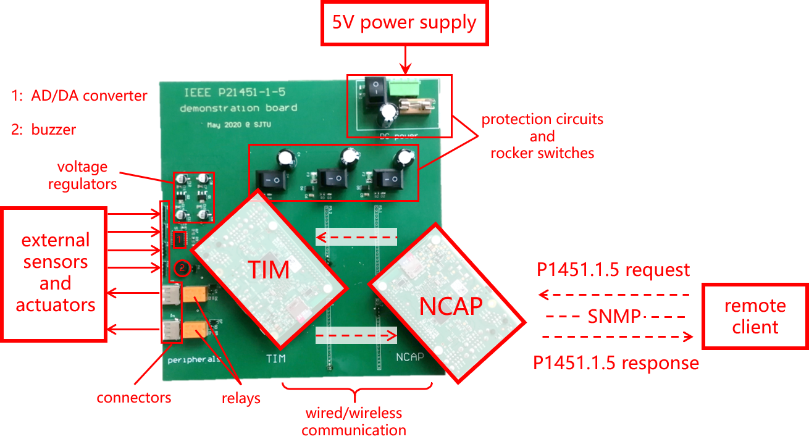

# IEEE P21451-1-5 Demonstration for INTEROP 2020

>**Abstract: IEEE P21451-1-5 standard specifies a universal and standardized way of accessing and managing Internet of Things (IoT) based on Simple Network Management Protocol (SNMP). In this article, we explain the basic concepts in IEEE P1451, provide an overview of IEEE P21451-1-5 standard and introduce the demonstration system to be presented in INTEROP 2020, including its building blocks, over-all structure and the workflow of IEEE P21451-1-5 in this demonstration system.** 

## 1. Introduction 

IEEE P21451-1-5 standard specifies a universal and standardized way of accessing and managing Internet of Things (IoT) using Simple Network Management Protocol (SNMP), which conforms to IEEE P1451.0 standard and thus features high interoperability with other application layer protocols, such as HTTP, XMPP and MQTT.

IEEE P21451-1-5 standard, like IEEE P1451.0, is a member of IEEE P1451 standard family [1], whose goal is to define common interfaces and services for IoT, enable “plug and play” of smart transducers (i.e. sensors and actuators) and promote interoperability among transducers made by different vendors or using different protocols. 

In the context of IEEE P1451, an IoT instance is carefully divided into two types of entities, named Transducer Interface Module (TIM) and Network-Capable Application Processor (NCAP), respectively. TIM is a smart transducer in which Transducer Electronic Data Sheet (TEDS) is located. TEDS is another key concept in IEEE P1451 standard, which stores comprehensive information about this transducer in a standardized format and makes the transducer self-describable, self-identifiable and therefore, “smart”. NCAP is the gateway of the transducer network, who provides network services to IoT users (clients) over various application layer protocols. Such a “TIM-NCAP” division  naturally results in two types of interfaces. The one between TIM and NCAP is called Transducer Independent Interface (TII) while the one between clients and NCAP is called Network Interface (NI), both of which are defined in IEEE P1451 standard. 

Specifically, IEEE P21451-1-5 standard focuses on NI of IEEE P1451-compatible IoT, exploits the management functionality of SNMP and extends its usage from traditional networks to IoT, providing a universal and standardized way of accessing and managing IoT using SNMP. 

## 2. Standard Overview
The draft of IEEE P21451-1-5 standard is under active development. This standard is aimed at addressing common issues during the process of accessing and managing IEEE P1451-compatible IoT using SNMP, and tentatively, the draft is going to include these featured contents:
-	Management Information Base (MIB) tailored for IEEE P1451-compatible IoT, as well as its coordination with TEDS.
-	Event notification service based on Trap PDUs of SNMP.
-	Security mechanisms based on View Access Control Model (VACM) or User-based Security Model (USM).  
-	Time synchronization mechanism over SNMP messages.
   
## 3. Material and Equipment
The main components of the demonstration system are listed below:
-	Raspberry Pi 3’s are used as the controller of NCAP as well as the controller of TIM. On each Pi there is a Broadcom BCM2837 SoC with 4 cores and 1.2 GHz clock rate, 1 GB memory, on-board 802.11n and BLE 4.1 adaptor. Interfaces include 4 USB 2.0 ports, one HDMI port, a 100 Mbit/s Ethernet port and a 40-pin GPIO port. A 16 GB TF card is used to boot the system and also serves as the external storage. For more information about Raspberry Pi’s hardware specification, please refer to the section Useful Links and Additional Information.
-	The operating system running on NCAP is CentOS 7 for `armv7hl` architecture, while the one running on TIM is Raspberry Pi OS (32-bit), which is previously known as Raspbian and is the official operating system for Raspberry Pi.
-	Various external sensors and actuators, for example, temperature sensor, photosensitive sensor, humidifier, fan, lamp and so forth.
-	A specially designed motherboard connects different parts of the system. It is a printed circuit board and should be powered by an external DC power supply with 5V output. It features protection circuits against overvoltage or short circuit, voltage regulators that generate 3.3V power supply, and rocker switches that enables the operator to control the on/off status of different subsystems. It has sockets and mechanical connectors whereby Raspberry Pi’s can be reliably installed. It provides pin headers to which external sensors and actuators can be connected. On the board itself there is an AD/DA converter chip that can perform signal conversion, an alarm buzzer and several relays, which are controllable and can be considered as on-board actuators.
-	A switching power supply with 5V/20A output is used to drive the whole system. Note that the power consumption of the system is much less than the supply and “5V/20A” is only chosen for redundancy and for scalability in the future. 
-	Keyboard, mouse and display can be connected to the system for programming, debugging and testing.
## 4. Demo Structure
Combining together all the components introduced in the last section, we obtain the demonstration system’s over-all structure, as shown in the Fig. 1.



**Fig. 1: IEEE P21451-1-5 Demonstration System** 

The process of accessing or managing IoT using SNMP goes as follows: Firstly, a client on the network initiates a request that is packed in P1451.1.5 format (that is, “1451.1 over SNMP”) and is sent to NCAP. Secondly, NCAP receives the request message, resolves it, translates it into standardized 1451 commands that can be recognized by TIMs (that is, “calls transducer services”) and then issues the commands to certain TIMs. The transmission in this step can either requires a physical cable between NCAP and TIM (using protocols like UART) or goes over the air (using Wi-Fi, BLE, etc.). Next, TIM responds to the commands by reading a sensor or regulating an actuator’s output, and replies with a response message. At last, the response message goes in reverse as the request message and is sent back to the client.

## 5. Useful Links and Additional Information

- Project main page of IEEE P21451-1-5 standard:  

  https://standards.ieee.org/project/21451-1-5.html

- Hardware specification of Raspberry Pi 3B:

  https://www.raspberrypi.org/products/raspberry-pi-3-model-b/

- Popular open-source SNMP implementations:

  `net-snmp`: http://www.net-snmp.org/

  `pysnmp`: https://github.com/etingof/pysnmp

- Some of the published research papers related to this topic are [2], [3] and [4].

## 6. Acknowledgment

The IEEE P21451-1-5 working group would like to express their very great appreciation to Kang Lee, Eugene Song and Victor Huang, for their generous help and insightful suggestions during the whole process of standard development. 

## 7. References

[1]	E. Y. Song and K. Lee, "Understanding IEEE 1451-Networked smart transducer interface standard - What is a smart transducer?," in IEEE Instrumentation & Measurement Magazine, vol. 11, no. 2, pp. 11-17, April 2008, doi: [10.1109/MIM.2008.4483728](https://doi.org/10.1109/MIM.2008.4483728).  

[2]	Longhua Guo, Jun Wu, Jingwei Li, Jianhua Li and W. J. Miller, "A lightweight secure time synchronization mechanism for ISO/IEC/IEEE 21451 sensor networks," 2015 IEEE International Symposium on Precision Clock Synchronization for Measurement, Control, and Communication (ISPCS), Beijing, 2015, pp. 13-18, doi: [10.1109/ISPCS.2015.7324673](https://doi.org/10.1109/ISPCS.2015.7324673).

[3]	X. Feng, J. Wu, J. Li and S. Wang, "Efficient Secure Access to IEEE 21451 Based Wireless IIoT Using Optimized TEDS and MIB," IECON 2018 - 44th Annual Conference of the IEEE Industrial Electronics Society, Washington, DC, 2018, pp. 5221-5227, doi: [10.1109/IECON.2018.8591182](https://doi.org/10.1109/IECON.2018.8591182).

[4]	J. Ren, Y. Liu, J. Wu, J. Li and K. Wang, "Smart NCAP supporting Low-Rate DDoS Detection for IEEE 21451-1-5 Internet of Things," 2019 IEEE International Conference on Industrial Cyber Physical Systems (ICPS), Taipei, Taiwan, 2019, pp. 532-535, doi: [10.1109/ICPHYS.2019.8780132](https://doi.org/10.1109/ICPHYS.2019.8780132).


# Interoperability Tests

## 1. Get Your Hands Dirty!

To get started, choose an SNMP client and install it. In this article, [`net-snmp`](http://www.net-snmp.org/) is used as the example.

### Linux

For some distros, try installing `net-snmp` (or the client only) with the native package manger:

```shell
# On Debian-based systems:
sudo apt install snmp
# On RHEL-based systems:
sudo yum install net-snmp-utils
```

<!--- TODO: check the package's availability on different systems -->

Otherwise, you should, unfortunately, build it from source following the steps in [this page](http://www.net-snmp.org/docs/INSTALL.html).

You may want to verify your installation by running:

```shell
snmpget --version
```

Run the following command as the hello-world routine:


```shell
snmpget -v 2c -c public 47.88.61.169 1.3.6.1.2.1.1.1.0
```

If you see something like this:

```
iso.3.6.1.2.1.1.1.0 = STRING: "Greetings from IEEE P21451-1-5 Working Group, Shanghai Jiao Tong University, Shanghai, China"
```

Congratulations! Your machine is now fired up.

### Windows


## 2. Access Our Demo Remotely

We expose the following sensors and actuators to remote testers: 

- one temperature sensor
- one photosensitive sensor
- one humidifier
- one lamp
- and one LCD screen 

From the standpoint of SNMP programs, each of these transducers is seen as a *variable*, either read-only or read/write. Each variable has a unique identifier, called [OID](https://en.wikipedia.org/wiki/Object_identifier). In our example, we put all these variables under a certain branch. Thus, their OIDs have a common prefix: `1.3.6.1.4.1`, which is named `enterprise` and is the parent node of most enterprises and organizations. 

The reset parts of these OIDs are illustrated with this tree view:

```shell
# Output of `snmptranslate -Tp IEEE-P1451-SIMPLE-DEMO-MIB::sjtu'
+--sjtu(7934)
   |
   +--ieeeP1451Project(1451)
      |
      +--ieeeP1451Sensor(1)
      |  |
      |  +-- -R-- INTEGER   seTemperature(1)
      |  |        Range: 0..255
      |  +-- -R-- INTEGER   seLight(2)
      |           Range: 0..255
      |
      +--ieeeP1451Actuator(2)
         |
         +-- -RW- EnumVal   acLamp(1)
         |        Values: off(0), on(1)
         +-- -RW- EnumVal   acHumidifier(2)
         |        Values: off(0), on(1)
         +-- -RW- String    acLcd(3)

```

For example, `acLamp` is the variable standing for the lamp in our demonstration system. It is the first child node (`.1`) of `ieeeP1451Actuator`, who in turn is the second child node (`.2`) of `ieeeP1451Project`, who again is the 1451st child node (`.1451`) of `sjtu`, who is the 7934th child node (`.7934`) of `enterprise` (`1.3.6.1.4.1`). Therefore, the complete OID of `acLamp` is `1.3.6.1.4.1.7934.1451.2.1`.

OIDs, among other attributes of these variables, are specified in the MIB file [IEEE-P1451-SIMPLE-DEMO-MIB.txt](IEEE-P1451-SIMPLE-DEMO-MIB.txt).

Knowing the OIDs, we are now able to access the corresponding transducers using SNMP SET/GET messages.

### Sensors (Read-Only)

```shell
# Read the current value of the temperature sensor
snmpget -v2c -c public 47.88.61.169 1.3.6.1.4.1.7934.1451.1.1.0
# Read the current value of the photosensitive sensor
snmpget -v2c -c public 47.88.61.169 1.3.6.1.4.1.7934.1451.1.2.0
```
### Actuators (Read-Write)

```shell
# Read the current on/off status of the lamp
snmpget -v2c -c public 47.88.61.169 1.3.6.1.4.1.7934.1451.2.1.0
# Turn on the lamp
snmpset -v2c -c public 47.88.61.169 1.3.6.1.4.1.7934.1451.2.1.0 i 1
# Turn off the lamp
snmpset -v2c -c public 47.88.61.169 1.3.6.1.4.1.7934.1451.2.1.0 i 0

# Read the current on/off status of the humidifier
snmpget -v2c -c public 47.88.61.169 1.3.6.1.4.1.7934.1451.2.2.0
# Turn on the humidifier
snmpset -v2c -c public 47.88.61.169 1.3.6.1.4.1.7934.1451.2.2.0 i 1
# Turn off the humidifier
snmpset -v2c -c public 47.88.61.169 1.3.6.1.4.1.7934.1451.2.2.0 i 0

# Read the current content on the LCD screen
snmpget -v2c -c public 47.88.61.169 1.3.6.1.4.1.7934.1451.2.3.0
# Change the display content on the LCD screen
# (It is appreciated if you can leave a message here telling us where you are conducting this test!)
snmpset -v2c -c public 47.88.61.169 1.3.6.1.4.1.7934.1451.2.3.0 s "Hi, I am Rick from universe C-137."
```


# Contact


**Jun WU**  \<junwuhn@sjtu.edu.cn\> received the Ph.D. degree in information and telecommunication studies from Waseda University, Japan, in 2011. He is currently an Associate Professor with the School of Cyber Security, Shanghai Jiao Tong University, China, where he is also the Vice Director of the National Engineering Laboratory for Information Content Analysis Technology. His research interests include advanced computing, communications and security techniques of software-defined networks, information-centric networks smart grids, and the Internet of Things.

<!---  NAT traversal configuration alternative solution: https://ourcodeworld.com/articles/read/1175/how-to-create-and-configure-your-own-stun-turn-server-with-coturn-in-ubuntu-18-04 -->

<!--- https://www.nomachine.com/AR07N00894 -->